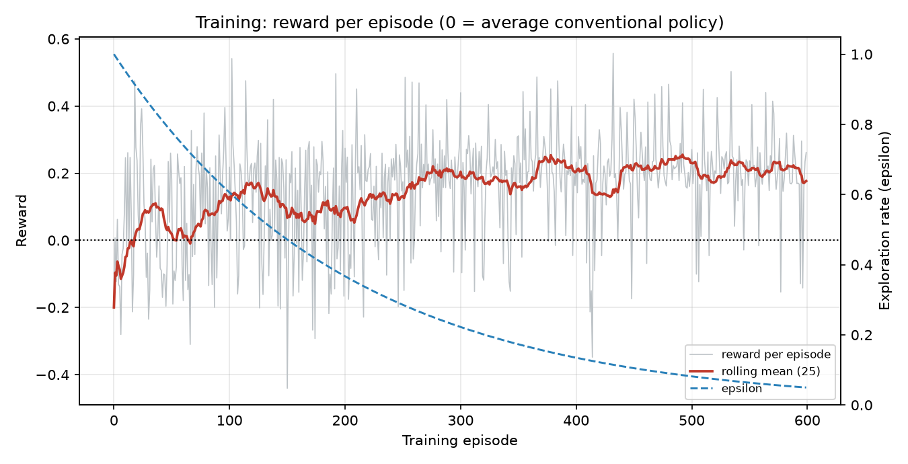
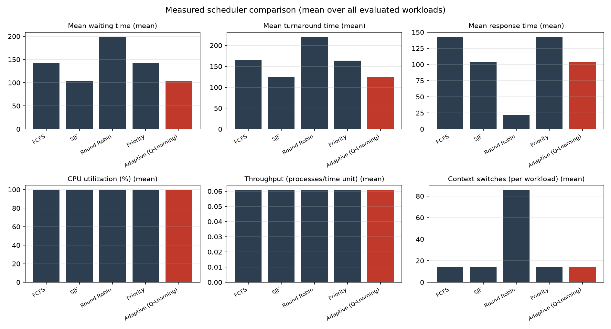
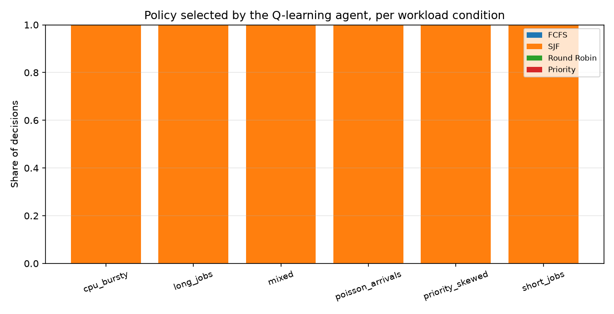
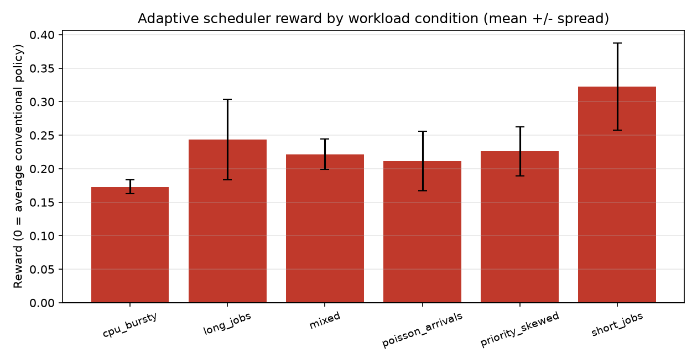
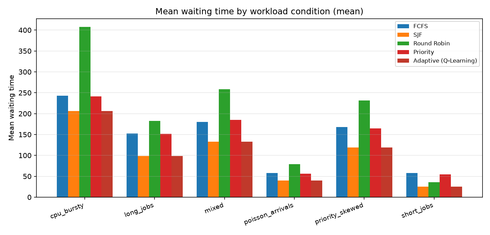
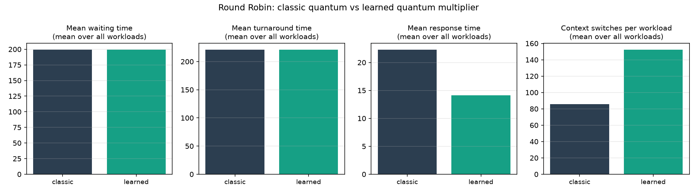
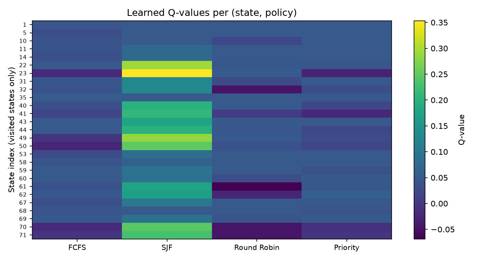

# Reinforcement Learning–Based Workload-Aware CPU Scheduling with Dynamic Policy Selection

A Python simulator of a **single CPU** in which a **tabular Q-learning** agent observes the
profile of a workload and **selects one of four conventional CPU scheduling policies** —
First-Come First-Served, Shortest Job First, Round Robin or Priority — for that workload.
The four policies are implemented independently and correctly; the agent is a
policy-selection layer on top of them, never a replacement for them.

Everything reported under [Measured results](#17-results) was produced by running this
code.  No value in this repository was entered by hand.

---

## 1. Problem statement

Conventional CPU scheduling policies are each optimal in a different regime.  Non-preemptive
Shortest Job First minimises mean waiting time when jobs can be compared, but it starves long
jobs and gives no responsiveness to short ones.  Round Robin bounds response time but pays for
it in context switches and in a higher mean turnaround time.  Priority scheduling respects the
importance of jobs but ignores their length, and FCFS is order-fair and otherwise weak.

A real workload mix contains all of these regimes.  The question this project asks is
therefore: *given a workload, can a reinforcement-learning agent learn which conventional
policy serves it best, using only information available before the workload runs?*

## 2. Motivation

* Scheduling is the classical OS problem where a small policy difference changes every
  performance metric, which makes it a good testbed for learning-based control.
* Reinforcement learning suits the problem because the best policy depends on the workload
  distribution, which is not known analytically and varies over time.
* Keeping the conventional algorithms intact and learning only *which* one to apply produces
  a system whose behaviour stays explainable: every schedule is a textbook schedule.

## 3. Objectives

1. Implement FCFS, SJF, Round Robin (configurable quantum) and non-preemptive Priority
   scheduling correctly, deterministically and independently.
2. Compute the six required metrics with standard definitions.
3. Generate reproducible synthetic workloads from several workload conditions.
4. Build a tabular Q-learning agent that selects a policy from a discretised workload state.
5. Compare the adaptive scheduler with each conventional policy **on identical workloads**.
6. Report only measured results, with the configuration and seeds recorded.

## 4. Scope

**In scope:** single-CPU simulation; abstract integer time units; synthetic workloads;
the four policies above; tabular Q-learning over the four actions; a documented quantum
controller for Round Robin; metric computation, comparison tables and Matplotlib figures.

**Out of scope (not implemented, not claimed):** Linux kernel integration, multi-core or
distributed scheduling, real-time scheduling, energy-aware scheduling, cloud/edge
scheduling, deep RL (DQN, PPO, actor-critic), databases, REST APIs, web front ends, Docker
or Kubernetes, and any use as a production scheduler.

## 5. System architecture

```
OS-Project/
├── main.py                     command-line entry point (experiment | train)
├── config.py                   every tunable value, in frozen dataclasses
├── errors.py                   ValidationError / ConfigurationError
├── workload/
│   ├── models.py               Process, Workload, ExecutionSlice, ProcessOutcome, ScheduleResult
│   └── generator.py            WorkloadGenerator: six workload conditions
├── scheduler/
│   ├── base.py                 Timeline, SchedulingPolicy, shared non-preemptive engine
│   ├── fcfs.py  sjf.py  round_robin.py  priority.py
├── evaluation/
│   ├── metrics.py              the six metrics, defined once
│   └── comparison.py           summary and comparison tables for the experiment
├── rl/
│   ├── state.py                StateSnapshot, binners, StateEncoder, observe_workload_state
│   ├── reward.py               reward equation and its breakdown
│   ├── q_learning.py           QLearningAgent + epsilon schedule
│   ├── quantum_controller.py   Round-Robin quantum controller (documented extension)
│   └── adaptive.py             AdaptiveScheduler: the learning loop
├── experiments/
│   ├── train.py                training loop and history
│   ├── evaluate.py             evaluation protocol and integrity checks
│   └── run_experiment.py       the full study, artefact writing
├── visualization/plots.py      Matplotlib figures (Agg backend)
├── tests/                      239 tests
├── docs/
│   ├── PHASE1_REQUIREMENTS_AUDIT.md   requirements audit performed before coding
│   └── DESIGN_AND_CHOICES.md          every open decision, documented
├── results/                    measured results of the committed run
├── figures/                    figures of the committed run
└── requirements.txt
```

Data flows one way: a workload is generated, its profile is encoded into a state, the agent
selects an action, the corresponding policy produces a `ScheduleResult`, metrics are computed
from that result, the reward is computed against the four conventional policies on the same
workload, and the Q-table is updated.  No module writes to another module's state, and no
value is shared through globals.

## 6. Scheduling algorithms

| Policy | Variant | Selection rule (ties broken as shown) |
|---|---|---|
| FCFS | non-preemptive | smallest `(arrival_time, pid)` |
| SJF | non-preemptive (no SRTF) | smallest `(burst_time, arrival_time, pid)` |
| Round Robin | preemptive, quantum = 4 | FIFO ready queue, `min(quantum, remaining)` per turn |
| Priority | non-preemptive, 1 = highest | smallest `(priority, arrival_time, pid)` |

A context switch is a change of the running process; the first dispatch is not counted, and a
process that keeps the CPU across a quantum boundary is not switched out.  Switching is
costless by default (`switching_cost = 0`) and merely counted; a positive cost is supported
and tested.  Full semantics — including the arrival convention at quantum boundaries — are in
[`docs/DESIGN_AND_CHOICES.md`](docs/DESIGN_AND_CHOICES.md) §2–§3.

## 7. Q-Learning approach

Tabular Q-learning, one decision per workload (see
[`docs/DESIGN_AND_CHOICES.md`](docs/DESIGN_AND_CHOICES.md) §1).  One episode is one workload:

```
workload -> observe state -> ε-greedy action -> run that policy -> metrics -> reward vs
four conventional policies -> Q(s,a) += α·(reward − Q(s,a)) -> next episode
```

| Setting | Value |
|---|---|
| α (learning rate) | 0.1 |
| γ (discount factor) | 0.9 (unused in value: episodes are single terminal transitions) |
| ε (exploration) | 1.0 → 0.05, multiplicative decay 0.995 per episode |
| Q₀ (initial value) | 0.05, optimistic so unexplored actions get tried |
| Training episodes | 600, workload conditions cycled |
| Evaluation | greedy (`ε = 0`), Q-table compared before/after and required to be unchanged |

The agent is genuinely table-driven: the test suite verifies that changing the Q-table changes
the evaluated decision.

## 8. State representation

Four pre-execution workload characteristics, discretised into 3 bins each → **81 states**.
CPU utilisation, queue length and waiting time cannot form the state because they are
*measured* quantities (the decision precedes execution), so their pre-execution analogues are
used; this substitution is documented in `docs/DESIGN_AND_CHOICES.md` §5.

| Variable | Meaning | Bins (low → high) |
|---|---|---|
| `burst_profile` | median burst time | < 3.68, 3.68–13.6, ≥ 13.6 |
| `burst_dispersion` | coefficient of variation of bursts | < 0.5, 0.5–1.0, ≥ 1.0 |
| `offered_load` | total burst time ÷ `max(1, arrival span)` | < 2.46, 2.46–12.1, ≥ 12.1 |
| `priority_spread` | σ of priorities | < 0.667, 0.667–1.333, ≥ 1.333 |

Encoded as a mixed-radix index with `burst_profile` most significant.  The state contains no
scheduling result and no metric, so it cannot leak the outcome of a decision.

## 9. Action space

| Action | Policy |
|---|---|
| 0 | FCFS |
| 1 | SJF |
| 2 | Round Robin |
| 3 | Priority |

## 10. Reward function

```
term_m = min(2.0, metric_m / reference_m)      reference_m = mean of metric m over the four
                                               conventional policies on the same workload
reward = Σ_benefits w_m (term_m − 1) + Σ_costs w_m (1 − term_m)

benefits : CPU utilisation 0.075, throughput 0.075
costs    : waiting 0.30, turnaround 0.25, response 0.20, context switches per process 0.10
```

`reward = 0` means "exactly as good as the average conventional policy on this workload";
positive means better.  Weights were declared before the experiment and not tuned afterwards.
The quantum controller uses the same equation with classic Round Robin as its reference.

## 11. Metrics

| Metric | Definition |
|---|---|
| Waiting time | `turnaround − burst`, mean over processes |
| Turnaround time | `completion − arrival`, mean over processes |
| Response time | `first execution − arrival`, mean over processes |
| CPU utilisation | `100 × busy time / total elapsed time` |
| Throughput | `processes / total elapsed time` |
| Context switches | changes of the running process; also reported per process |

## 12. Installation

Python 3.10+ is required (3.11 was used).  Dependencies: NumPy, pandas, Matplotlib, pytest.

```bash
python3 -m venv .venv && . .venv/bin/activate   # recommended, keeps the system clean
pip install -r requirements.txt
```

On a Debian/Ubuntu system with an externally managed Python, `pip install --break-system-
packages -r requirements.txt` also works, at the cost of installing into the system Python.

## 13. Usage

```bash
python3 main.py experiment     # train, evaluate, write tables and figures (default)
python3 main.py train          # train only and print the training history
python3 main.py experiment --no-figures --results-dir /tmp/results --figures-dir /tmp/figures
```

Intermediate results can also be produced from Python:

```python
from config import build_default_config
from experiments.train import train
from experiments.evaluate import evaluate
from rl.state import observe_workload_state
from workload.generator import WorkloadGenerator

config = build_default_config()
generator = WorkloadGenerator(config.families)
training = train(config, generator=generator)
evaluation = evaluate(config, training, generator=generator)

snapshot = observe_workload_state(generator.generate("cpu_bursty", 12345))
print(snapshot)                                    # raw state variables
print(training.encoder.encode(snapshot))           # discretised state index
print(training.agent.greedy_action(training.encoder.encode(snapshot)))  # selected action
```

## 14. Testing

```bash
python3 -m pytest -q
```

**239 tests, all passing** (~6 s).  They cover workload validation, the four schedulers against
hand-computed schedules, metric definitions, state construction and discretisation, the reward
equation, Q-table updates (verified numerically against the update rule), ε-greedy selection
and its reproducibility, the quantum controller, the adaptive scheduler (training updates the
table; evaluation provably does not), the experiment pipeline (identical workloads, disjoint
training/evaluation sets, artefact writing, rerun equality) and the command-line interface.

## 15. Experiment reproduction

```bash
python3 main.py experiment
```

This is the single command that reproduces the study.  It uses the frozen configuration in
`config.py` (no hyperparameter can be overridden from the command line), and writes:

| Artefact | Content |
|---|---|
| `results/config.json` | every hyperparameter, quantum, workload rule, seed and metric list |
| `results/training_history.json` | per-episode family, workload fingerprint, state, action, reward, ε |
| `results/q_table.json` | the learned Q-table with state bins and visit counts |
| `results/workloads.csv` | the 60 evaluated workloads and their fingerprints |
| `results/metrics.csv` | one row per (workload, scheduler, regime) — 420 rows |
| `results/decisions.csv` | one row per adaptive decision with its state and reward |
| `results/summary.json` | every table quoted below |
| `figures/*.png` | seven figures, all built from the rows above |

Configuration: 600 training episodes (seed 42) over six workload conditions; evaluation
10 repetitions × 6 conditions = 60 workloads (seed 2024, disjoint from training);
Round-Robin quantum 4; switching cost 0; 81 states × 4 actions; α 0.1, γ 0.9, ε 1.0 → 0.05.

Reproducibility was verified by running the pipeline twice into separate directories and
comparing `metrics.csv`, `decisions.csv` and `q_table.json` byte for byte (a test does this
on a reduced configuration; the committed files are from a single run of the full one).

## 16. Expected outcome vs measured result

Stated explicitly, because the two must not be confused:

* **Expected before running:** the agent would choose *different* policies for different
  workload conditions (the premise of workload-aware selection), and would therefore beat
  the conventional baselines on the metrics it is rewarded for.  Theory also predicts that
  non-preemptive SJF minimises mean waiting time for a batch and that Round Robin trades
  turnaround time for response time.
* **Measured:** the agent converged to SJF and selected it for **all 120 evaluated
  decisions**, i.e. it is adaptive in behaviour but *not* condition-dependent here; it beats
  FCFS, Priority and Round Robin on waiting and turnaround time by 29–47 %, and Round Robin
  beats it on response time by a factor of 4.6.  The details, with the numbers, follow.

## 17. Results

All numbers below come from `results/summary.json` of the committed run.

### 17.1 Training (600 episodes, seed 42)

| Quantity | Value |
|---|---|
| Mean reward, first 100 episodes | +0.0629 |
| Mean reward, last 100 episodes | +0.2013 |
| Mean reward, all episodes | +0.1553 |
| Episodes whose action was not the greedy one | 25.0 % |
| States visited | 27 of 81 |
| Actions selected (all episodes) | FCFS 64, SJF 434, Round Robin 53, Priority 49 |
| Actions selected when not exploring | FCFS 21, SJF 426, Round Robin 1, Priority 2 |
| Round-Robin quantum multipliers chosen by the controller | ×0.5: 385, ×1: 146, ×2: 69 |



### 17.2 Evaluation (60 workloads, seed 2024)

Mean over the 60 workloads (per workload, then averaged), for the five schedulers:

| Scheduler | Waiting time | Turnaround | Response | CPU util. (%) | Throughput | Context switches |
|---|---|---|---|---|---|---|
| FCFS | 142.99 | 164.77 | 142.99 | 99.7623 | 0.06092 | 14.00 |
| SJF | 103.58 | 125.37 | 103.58 | 99.7623 | 0.06092 | 14.00 |
| Round Robin | 199.13 | 220.92 | 22.31 | 99.7623 | 0.06092 | 85.78 |
| Priority | 142.24 | 164.02 | 142.24 | 99.7623 | 0.06092 | 14.00 |
| **Adaptive (Q-Learning)** | **103.58** | **125.37** | 103.58 | 99.7623 | 0.06092 | 14.00 |



Baseline ÷ adaptive ratio per workload (mean of the per-workload ratios; > 1 means the
baseline is worse for a cost metric such as waiting time):

| Baseline | Waiting | Turnaround | Response | CPU util. | Throughput | Switches |
|---|---|---|---|---|---|---|
| FCFS | 1.5743 | 1.4413 | 1.5743 | 1.0000 | 1.0000 | 1.0000 |
| SJF | 1.0000 | 1.0000 | 1.0000 | 1.0000 | 1.0000 | 1.0000 |
| Round Robin | 1.8839 | 1.7111 | **0.3402** | 1.0000 | 1.0000 | 6.1274 |
| Priority | 1.5414 | 1.4166 | 1.5414 | 1.0000 | 1.0000 | 1.0000 |

Reading of these numbers:

* The adaptive scheduler reduced mean waiting time by **36.5 %** against FCFS, **46.9 %**
  against Round Robin and **35.1 %** against Priority, and matched SJF exactly, because under
  the learned table every evaluated state has SJF as its greedy action.
* It was **worse than Round Robin on response time** (103.58 vs 22.31, ratio 0.34): Round
  Robin starts every process early, which is exactly what the response-time metric rewards.
  The agent did not choose Round Robin because the reward's response weight (0.20) is
  outweighed by its waiting (0.30) and turnaround (0.25) penalties, where Round Robin is
  1.88× and 1.71× worse than the adaptive choice.
* CPU utilisation and throughput are **identical for every scheduler on every workload**
  (ratio exactly 1.0000).  With a work-conserving single CPU and no switching cost the
  makespan equals the total burst time plus policy-independent idle time; measured, no
  evaluated workload ever left the CPU without pending work, so these two metrics cannot
  discriminate the policies in this model.  They are still computed and reported as required.
* Context switches are structurally `n − 1 = 14` for the three non-preemptive policies and
  6.1× higher for Round Robin (85.78), which is the trade-off behind its response-time win.

### 17.3 Policy selection per workload condition

The agent selected **SJF in 20 of 20 workloads for every one of the six conditions** (120 of
120 decisions across both evaluated regimes).  Mean reward per condition — 0 means "equal to
the average conventional policy":

| Condition | Selected policy | Mean reward |
|---|---|---|
| short_jobs | SJF (20/20) | +0.3227 |
| long_jobs | SJF (20/20) | +0.2436 |
| priority_skewed | SJF (20/20) | +0.2259 |
| mixed | SJF (20/20) | +0.2217 |
| poisson_arrivals | SJF (20/20) | +0.2116 |
| cpu_bursty | SJF (20/20) | +0.1729 |





The conventional policy with the lowest mean waiting time is SJF in every condition — the
same conclusion the agent reached — so on this reward the learning problem has a
condition-independent optimum.  14 distinct states occurred in evaluation, all of them visited
during training (between 5 and 109 updates each), so no decision relied on an unvisited state.

### 17.4 Round-Robin quantum controller (documented extension)

The controller was disabled for the headline comparison and measured directly by running
Round Robin with the learned multiplier on the same 60 workloads (it chose ×0.5 for 41 of them
and ×1.0 for the other 19; both quanta are integers, 2 and 4 time units):

| Metric | Classic quantum (4) | Learned quantum | Ratio |
|---|---|---|---|
| Mean waiting time | 199.13 | 199.53 | 0.9991 |
| Mean turnaround time | 220.92 | 221.31 | 0.9991 |
| Mean response time | 22.31 | **14.14** | 1.6746 |
| CPU utilisation (%) | 99.7623 | 99.7623 | 1.0000 |
| Throughput | 0.06092 | 0.06092 | 1.0000 |
| Context switches | 85.78 | **152.50** | 0.6714 |

The learned quantum **cut mean response time by 36.6 %** (22.31 → 14.14) while leaving waiting
and turnaround time essentially unchanged (0.2 % worse) and **increasing context switches by
77.8 %**.  That is the classical quantum trade-off, learned from data rather than chosen by
hand.




## 18. Limitations

1. **Offline workload view.** The state describes the whole job list.  A scheduler that does
   not know future arrivals could not compute it; the study is therefore a batch-view result,
   not an online one.
2. **The learned policy is not condition-dependent here.** With the declared reward weights,
   SJF is optimal in every configured condition, so the agent's *behaviour* is constant.
   Making the selection genuinely condition-dependent would need a reward or workload set where
   different conditions favour different policies — that is an experiment-design change, not a
   bug fix, and is not claimed to have been achieved.
3. **CPU utilisation and throughput cannot discriminate** the policies under this model
   (no switching cost, work-conserving policies, no workload with long idle gaps).
4. **Round Robin is penalised in the reward.** Its response-time advantage is real and
   measured, but the declared weights rank waiting and turnaround above response, so the agent
   prefers SJF.  Different weights would move that boundary; the weights were not tuned.
5. **Single CPU, abstract time, no switching cost by default.** No I/O, no blocking, no
   deadlines, no priority inheritance, no multi-core effects.  A context switch costs nothing
   unless `switching_cost` is set.
6. **Priority is not rewarded.** Because only mean metrics enter the reward, priority-aware
   behaviour (serving high-priority jobs) is not valued, which is why Priority scheduling is
   not selected.
7. **Tabular and small.** 81 states, 4 actions; 27 states were visited in training.  Each of
   the 600 episodes schedules the *same* 15-process workload type, so results are specific to
   the six declared conditions and their parameter ranges.
8. **The quantum controller is an extension**, not part of the four policies, and it is
   excluded from the headline comparison by default.  It is reported separately.

## 19. Future scope

* Re-select the policy *during* execution at defined decision epochs, with an explicit rule for
  preempting a running process and a state that only uses information available at that epoch.
* Reward priority satisfaction (e.g. weighted waiting time or deadline misses) so that a
  priority-aware choice becomes learnable.
* Extend the workload families so that different conditions genuinely favour different
  policies, and check whether the agent then varies its selection.
* Sweep the quantum and the reward weights as *reported* sensitivity analyses (with the
  primary configuration kept fixed and declared).
* Leave-one-condition-out training/evaluation to test generalisation to unseen conditions.
* Compare against a non-learning oracle that always picks the best fixed policy per condition,
  as an explicit upper bound for the reported conditions.
* Add a bounded per-switch cost to the main protocol and re-measure all six metrics.

Deliberately excluded (see §4): multi-core, distributed, real-time, energy-aware or kernel
scheduling, and deep reinforcement learning.

---

### Repository notes

* `docs/PHASE1_REQUIREMENTS_AUDIT.md` — the requirements extracted before coding, and the
  decisions that had to be fixed to proceed.
* `docs/DESIGN_AND_CHOICES.md` — every unspecified choice, its justification and where to
  change it (scheduler variants, tie-breaking, state discretisation, reward weights,
  hyperparameters, experiment protocol).
* `results/` and `figures/` — the measured outputs of `python3 main.py experiment`.
* The project is a simulator: it does not modify, replace or interact with any operating
  system kernel.
